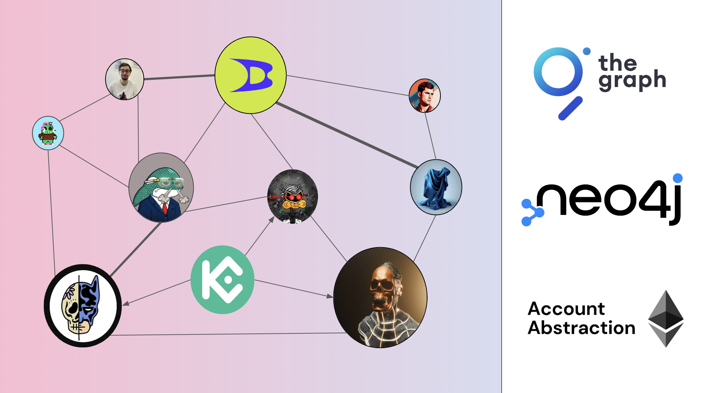

# 🌐 Universal Graph - ETHPrague 2024



## Presentation

A Social graph for smart accounts. It highlights interactions through user friendly experience and engagement between EOAs, smart accounts (account abstraction) and smart contracts. The main objective is on chain activity analysis and monitoring.

It works as follow:

1. data from The Graph (indexed via a subgraph) is retrieved via graphql in JSON.
2. The JSON data is then processed in CSV and injected in a Neo4j database.
3. The Neo4j instance performs query to generate data that can be consumed to generate a network visualisation (nodes, edges, weight, relationships).
4. The dApp connects to the Neo4j instance using [`neo4j-driver`](https://www.npmjs.com/package/neo4j-driver) package.
5. The data retrieved is then consumed and displayed visually on the interface as a network using **D3.js**.

### Built with

- [The Graph](./api/)
- [Neo4j](https://neo4j.com/)
- [Next.js](https://nextjs.org/)
- [d3.js](https://d3js.org)
- [LSPs standards](https://docs.lukso.tech/standards/introduction)

## Installation

### Dependencies

`npm install`

### Environment variables

`cp .env.example .env`

Ask a member of the social graph team (@CJ42 or @magalimorin18) for the NEXT_PUBLIC_NEO4J_PASSWORD.

POLLING_INTERVAL_IN_SECONDS is a variable which is used when retrieving profiles and transaction at a steady interval from the blockchain and upload them to NEO4J. By default, it's set to 12 seconds.

WRITE_TO_CSV is a used in dev mode. Set it to true in order to see the structure of the data retrieved from Envio OR to upload manually the data to NEO4J. The csv files are created in the `api/data` folder.

## Frontend

First, run the development server:

```bash
npm i
npm run dev
```

Open [http://localhost:3000](http://localhost:3000) with your browser to see the result.

## Backend

You can run the following commands to query the Envio Node and upload data to neo4j

```bash
npm run graph
```

https://envio-testing.mainnet.lukso.dev/

This script will fo an initial sweep of the blockchain. It will query all the profiles and all the transactions and add them to the NEO4j database.

Once the initial sweep is complete, the script will retrieve new profiles and transactions every POLLING_INTERVAL_SECONDS.

### HELPER: Cypher queries

#### Create relationships

```
MATCH (transactions:Transactions)
UNWIND transactions as tx
MERGE (sender:Profiles {id: tx.from})
MERGE (recipient:Profiles {id: tx.to})
CREATE (sender)-[:TX]->(recipient)
```

#### Delete all relationships

```
MATCH (n:Profiles)-[r:TX]->()
DELETE r
```
